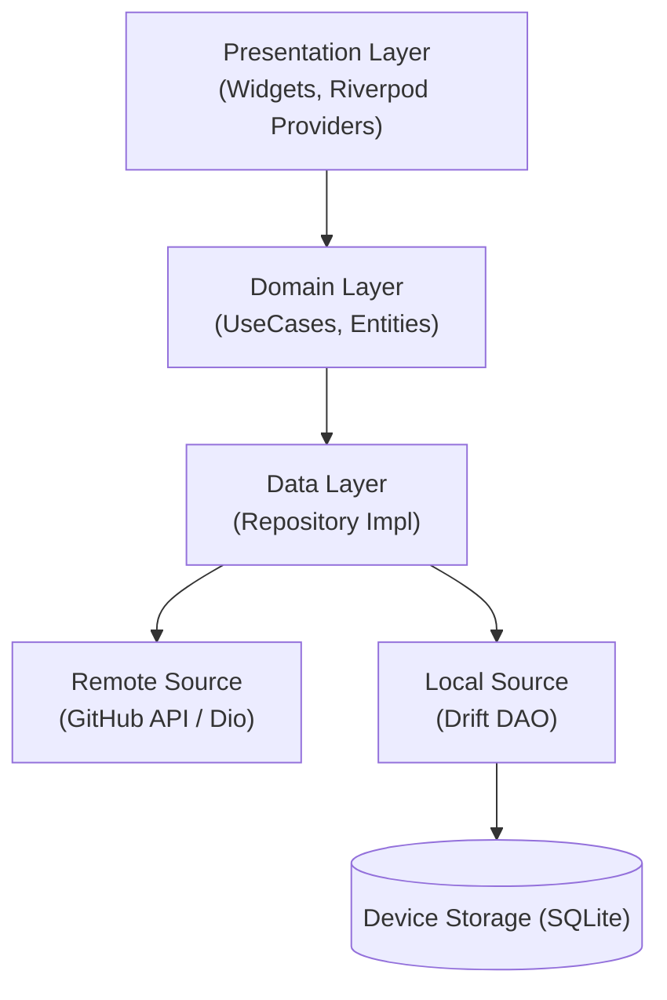

# RepoExplorer


**RepoExplorer** is a modern, high-fidelity cross-platform application that allows users to search for GitHub repositories, view detailed statistics, and manage favorites offline. Built with a focus on **Clean Architecture**, **Material 3 Design**, and **Offline-First** principles using the Flutter framework.

---

## Download

Try the latest build on your device:

[](https://github.com/EngFred/RepoExplorer/releases/download/v1.0/RepoExplorer.apk)

---

## Screenshots

| Search & Pagination | Repository Details | Favorites (Offline) |
|:-------------------:|:------------------:|:-------------------:|
|  |  |  |
| *Infinite scrolling with Pagination* | *2x2 Stats Grid & Material 3* | *Persisted via Drift Database* |

---

## Key Features

* **🚀 Infinite Search**: Leverages **Infinite Scroll Pagination** to handle GitHub's search API efficiently, loading results in pages to minimize data usage and maximize performance.
* **💾 Offline Favorites**: Uses **Drift (SQLite)** as a single source of truth for favorite repositories. Favorites are accessible even without an internet connection.
* **⚡ Reactive UI**: Built entirely with **Flutter**, using **Riverpod** for robust, testable, and reactive state management.
* **🎨 High-Fidelity Design**: Implements a custom **Dark Mode** theme inspired by GitHub's "Dimmed" appearance, featuring custom cards, stat badges, and smooth transitions.
* **🛡️ Robust Error Handling**: Gracefully handles network errors, rate limiting (HTTP 429), and empty states with user-friendly feedback.

---

## Tech Stack

* **Framework**: [Flutter](https://flutter.dev/) (Dart)
* **Architecture**: Clean Architecture (Presentation, Domain, Data)
* **State Management**: [Riverpod](https://riverpod.dev/)
* **Dependency Injection**: [GetIt](https://pub.dev/packages/get_it) + [Injectable](https://pub.dev/packages/injectable)
* **Network**: [Dio](https://pub.dev/packages/dio)
* **Local Storage**: [Drift](https://drift.simonbinder.eu/) (SQLite abstraction)
* **Pagination**: [Infinite Scroll Pagination](https://pub.dev/packages/infinite_scroll_pagination)
* **Navigation**: [GoRouter](https://pub.dev/packages/go_router)
* **Code Generation**: [Freezed](https://pub.dev/packages/freezed) & [JsonSerializable](https://pub.dev/packages/json_serializable)

---

## Architecture

The app follows strict **Clean Architecture** principles to ensure separation of concerns and testability.



### Design Decisions & Trade-offs

1.  **Single Source of Truth for Details**:
    The `getRepo(id)` use case checks the local Drift database first. If the user has favorited the repo, we serve the cached version immediately. This ensures the "Favorite" status is always accurate and persists across app restarts.

2.  **Infinite Scroll Pagination**:
    Instead of a simple list, we use the `infinite_scroll_pagination` package to handle the potentially huge results from GitHub. This mirrors the efficiency of Paging 3 in Android.

3.  **Code Generation**:
    We use `Freezed` for immutable data classes and `Injectable` for dependency injection. While this adds a build step, it significantly reduces boilerplate and runtime errors compared to manual implementation.

---

## Getting Started

1.  **Clone the repository**:
    ```bash
    git clone [https://github.com/EngFred/RepoExplorer--Flutter.git](https://github.com/EngFred/RepoExplorer--Flutter)
    cd flutter_repoexplorer
    ```
2.  **Install Dependencies**:
    ```bash
    flutter pub get
    ```
3.  **Run Code Generator** (Required for DI, Freezed, and Drift):
    ```bash
    dart run build_runner build --delete-conflicting-outputs
    ```
4.  **Run the App**:
    Select your emulator or physical device and run:
    ```bash
    flutter run
    ```

*Note: The app uses the public GitHub API. No API Key is required for basic usage, though rate limits apply.*

---

## Contributing

Contributions are welcome! Please fork the repository and submit a pull request.

## License

This project is licensed under the MIT License - see the [LICENSE](LICENSE) file for details.